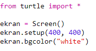
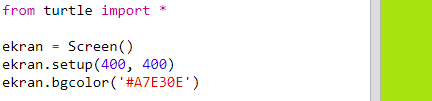
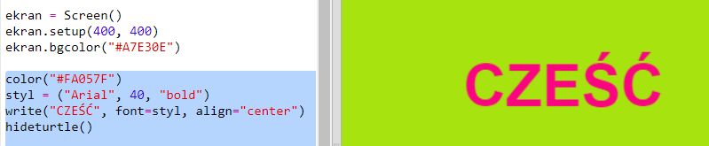

## Używanie heksadecymalnych kodów koloru

W Pythonie żółw do rysowania zna kolory takie jak "red" i "white", ale możesz również użyć heksadecymalnych kodów koloru (być może kojarzysz je z kursu HTML & CSS.)

+ Otwórz pusty szablon dla języka Python w edytorze Trinket: <a href="https://trinket.io/python/95059b88ed" target="_blank">trinket.io/python/95059b88ed</a>.

+ Dodaj następujący kod, który skonfiguruje odpowiednio żółwia:
    
    
    
    Zauważ, że użyliśmy koloru wpisując jego nazwę: "white".

+ Żółw ma listę nazw kolorów, których możesz użyć, ale czasami chcesz wybrać własne kolory. Żółw pozwala również używać heksadecymalnych kodów koloru.
    
    Otwórz <a href="http://jumpto.cc/colour-picker" target="_blank">jumpto.cc/colour-picker</a> i wybierz kolor, który ci się podoba. Znajdź kod heksadecymalny zaczynający się od "#", na przykład "#A7E30E".

+ Skopiuj kod heksadecymalny, razem ze znakiem hash (#), zaznaczając go, a następnie klikając prawym przyciskiem myszy i wybierając opcję Kopiuj lub używając kombinacji klawiszy Ctrl-C.

+ Teraz zmień linię kodu, która ustawia kolor ekranu tak, aby używała twojego koloru. Na przykład:
    
    
    
    Możesz kliknąć prawym przyciskiem myszy i wybrać opcję Wklej lub Ctrl-V, aby wkleić swój heksadecymalny kod do trinketa.

+ Wybierz inny heksadecymalny kod koloru i użyj go, aby stworzyć kolorowy tekst:
    
    
    
    Nie musisz używać czcionki "Arial", możesz wypróbować "Verdana", "Times" albo "Courier".
    
    "40" to rozmiar czcionki, to też możesz zmienić.

+ Wypróbuj różne kolory, aż znajdziesz dwa, które ci się podobają i naprawdę dobrze wyglądają razem.