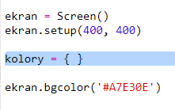
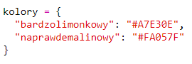
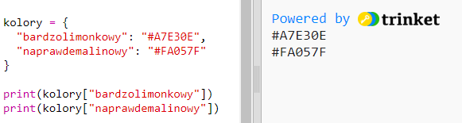
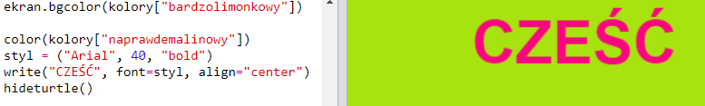

## Słownik kolorów

Używanie kodów szesnastkowych jest bardzo elastyczne, ale trudno je zapamiętać.

Jak już zapewne wiesz, słownik pozwala ci znaleźć słowo i sprawdzić, co ono znaczy. W Pythonie słownik jest jeszcze bardziej elastyczny, ponieważ pozwala wyszukiwać wartości dla dowolnego "klucza" w słowniku.

Stwórzmy słownik do tłumaczenia z przyjaznych dla człowieka nazw kolorów (kluczy) do przyjaznych dla komputera kodów szesnastkowych (wartości).

+ Słownik zapisujemy w nawiasach klamrowych.
    
    Utwórz pusty słownik o nazwie `kolory`:
    
    

+ Wybierz fajne nazwy dla swoich kolorów i zmień linię z kodem `kolory =`, aby dodać je do słownika.
    
    Oto przykładowy słownik kolorów:
    
    
    
    Dwukropek `:` oddziela klucz (nazwę koloru) od wartości (kodu szesnastkowego). Pomiędzy każdą parą klucz:wartość zawsze wstawiamy przecinek `,`.

+ Teraz nie musisz pamiętać kodów szesnastkowych, możesz po prostu sprawdzić je w słowniku.
    
    Dostosuj poniższy kod w taki sposób, aby użyć w nim swoich nazw kolorów:
    
    
    
    Klucz znajduje się w nawiasach kwadratowych "[]" zaraz po nazwie słownika.

+ Teraz możesz zaktualizować swój kod, aby wyszukać kolory w słowniku:
    
    

+ Przetestuj swój kod, aby upewnić się, że tekst nadal wyświetla się poprawnie.