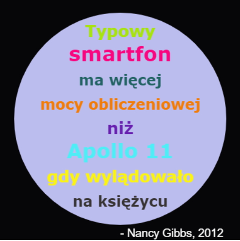

\--- challenge \---

## Wyzwanie: Stwórz plakat

Projektanci często tworzą "paletę" kolorów, które dobrze współgrają ze sobą w danej tematyce, takiej jak pustynia czy kosmos.

Czy możesz utworzyć nowy projekt Pythona, który używa słownika do tematycznej palety kolorów. Możesz wybrać jesień, las, morze, Boże Narodzenie, lody, kolory ulubionej drużyny sportowej lub własny pomysł.

Utwórz plakat przy użyciu słownika palety kolorów.

Możesz także użyć innych poleceń żółwia, takich jak `, przedni`, `w prawo,`, `w lewo,`, `, podsumowanie` i `, pendown`.

Może mógłbyś dodać granicę do swojego plakatu?

Inne użyteczne polecenia żółwia:

+ `okrąg (50)` rysuje kontur koła o promieniu 50.
+ `kropka (100)` rysuje wypełniony okrąg o średnicy 100. 

Oto przykład:

\--- / wyzwanie \---