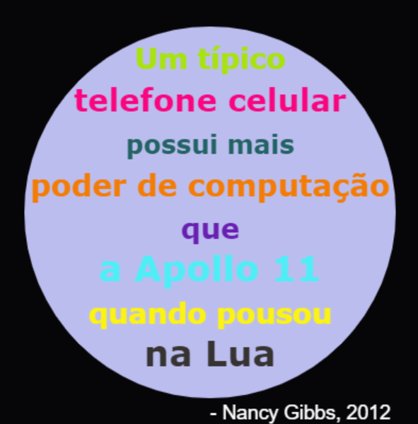

## Introdução

Neste projeto, você criará um dicionário de cores que mapeia os códigos de cores difíceis de lembrar em nomes amigáveis.

  <iframe src="https://trinket.io/embed/python/97822f48b7?outputOnly=true&start=result" width="600" height="500" frameborder="0" marginwidth="0" marginheight="0" allowfullscreen>
  </iframe>
  

### Informação adicional para os líderes dos clubes

Se você precisar imprimir este projeto, use a [versão para impressão](https://projects.raspberrypi.org/en/projects/colourful-creations/print).

## \--- collapse \---

## title: Notas do líder do clube

## Introdução:

Este projeto introduz aos dicionários ao criar um dicionário que define nomes de cores amigáveis para os códigos hexadecimais. Os códigos das cores são pesquisados ​​no dicionário e usados ​​para criar um pôster colorido.

## Recursos Online

**Este projeto usa o Python 3.** Recomendamos usar o [trinket](https://trinket.io/) para escrever Python online. Este projeto contém os seguintes Trinkets:

* [Ponto de partida 'Criações coloridas' - jumpto.cc/python-new](http://jumpto.cc/python-new)

Há também um trinket contendo um projeto concluído para os desafios:

* ['Criações Coloridas' concluído -- trinket.io/python/41a99e668b](https://trinket.io/python/97822f48b7)

## Recursos Offline

Este projeto pode ser [concluído off-line](https://www.codeclubprojects.org/en-GB/resources/python-working-offline/) , se preferir. Você pode acessar os recursos do projeto clicando no link 'Materiais do Projeto' para este projeto. Este link contém uma seção 'Recursos do Projeto', que inclui recursos que as crianças precisarão para concluir esse projeto off-line. Certifique-se de que cada criança tenha acesso a uma cópia desses recursos. Esta seção inclui os seguintes arquivos:

* colourful-creations/colourful-creations.py

You can also find a completed version of this project's challenges in the 'Club leader resources' section, which contains:

* Colorido-criações-acabado / colourful-creations.py

(Todos os recursos acima também podem ser baixados como arquivos `.zip` do projeto e dos voluntários.)

## Objetivos de aprendizado

* Dicionários - criando e procurando valores;
* Turtle graphics - texto, fontes e cores;

Este projeto abrange elementos das seguintes vertentes do [Currículo de Criação Digital Raspberry Pi](http://rpf.io/curriculum):

* [Usar estruturas básicas de programação para criar programas simples.](https://www.raspberrypi.org/curriculum/programming/creator)

* [Projetar designs básicos em 2D e 3D.](https://www.raspberrypi.org/curriculum/design/creator)

## Desafios

* Mais cores! - Use um site de seletor de cores para encontrar códigos hexadecimais para mais cores e adicioná-los ao dicionário. 
* Criar um pôster - crie um dicionário de paleta de cores personalizado e use-o para criar um pôster usando Turtle graphics. 

## Perguntas Frequentes

* As crianças podem precisar serem lembradas sobre a vírgula ',' no final de cada entrada do dicionário. 

\--- /collapse \---

## \--- collapse \---

## title: Materiais do projeto

## Recursos do projeto

* [Arquivo .zip contendo todos os recursos do projeto](resources/colourful-creations-project-resources.zip)
* [Trinket de Python em branco on-line](http://jumpto.cc/python-new)
* [Arquivo Python offline em branco](resources/new-new.py)

## Recursos do líder do clube

* [Arquivo .zip contendo todos os recursos do projeto concluídos](resources/colourful-creations-volunteer-resources.zip)
* [Projeto Trinket concluído online](https://trinket.io/python/97822f48b7)
* [colourful-creations-finished/colourful-creations.py](resources/colourful-creations-finished-colourful-creations.py)

\--- /collapse \---