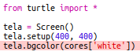
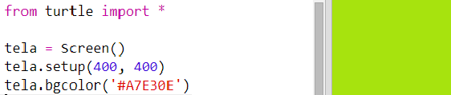
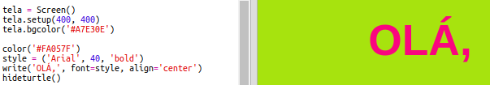

## Usando códigos de cores hexadecimais

A turtle(tartaruga) Python tem cores predefinidas, como 'vermelho' e 'branco', mas você também pode usar códigos de cores hexadecimais (Cocê pode ter visto isso no curso de HTML & CSS)

+ No Trinket abra um modelo em branco do Python: <a href="http://jumpto.cc/python-new" target="_blank">jumpto.cc/python-new</a>.

+ Adicione o seguinte código para usar a turtle(tartaruga):
    
    
    
    Observe que você usou uma cor nomeada: 'branco'.

+ A turtle tem uma lista de nomes de cores que você pode usar, mas às vezes você quer escolher suas próprias cores. A turtle também permite que você use códigos de cores hexadecimais.
    
    Abra <a href="http://jumpto.cc/colour-picker" target="_blank">jumpto.cc/colour-picker</a> e escolha a cor de sua preferência. Encontre o código hexadecimal que começa com um '#', por exemplo a '#A7E30E'.

+ Copie o código hexadecimal, incluindo a cerquilha(hashtag), realçando-o e, em seguida, clicando com o botão direito e escolhendo a opção Copiar ou usando Ctrl + C.

+ Agora mude a linha de código que define a cor da tela para usar sua cor. Por exemplo:
    
    
    
    Você pode usar o botão direito do mouse e escolhendo a opção Colar ou Ctrl + V para colar o código hexadecimal no trinket.

+ Escolha outro código de cor hexadecimal e use-o para criar um texto colorido:
    
    
    
    Você não precisa usar a fonte 'Arial', você pode tentar 'Verdana', 'Times' ou 'Courier'.
    
    '40' é o tamanho da fonte, você pode tentar mudar isso também.

+ Experimente cores diferentes até obter duas cores que você realmente goste e que combinem bem.