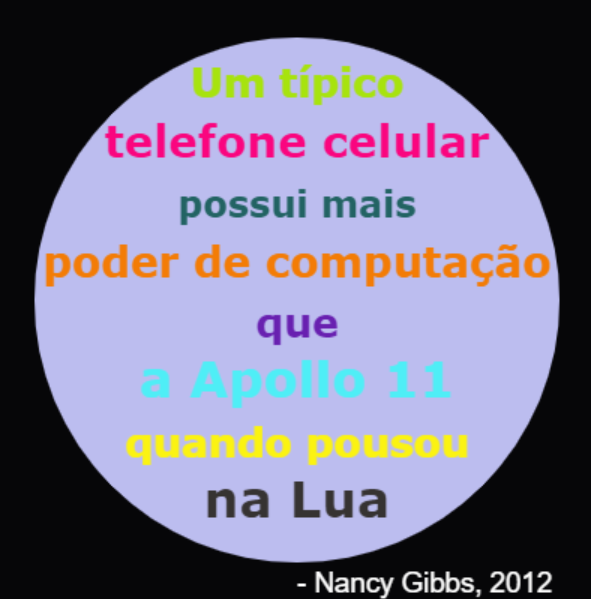

\--- desafio \---

## Desafio: criar um pôster

Designers geralmente criam uma 'paleta' de cores que funcionam bem juntas para um tema específico, como deserto ou espaço.

Você pode criar um novo projeto Python que usa um dicionário para uma paleta de cores temática. Você pode escolher o outono, floresta, mar, Natal, sorvete, as cores do seu time favorito ou uma idéia de sua preferência.

Crie um pôster usando o dicionário da paleta de cores.

Você também pode usar outros comandos de tartaruga conhecidos como `para a frente`, `para a direita`, `para a esquerda`, `para a penup` e `para a`.

Talvez você possa adicionar uma borda ao seu pôster?

Outros comandos úteis de tartaruga:

+ `circle (50)` desenha um contorno de círculo com raio 50.
+ `ponto (100)` desenha um círculo preenchido com diâmetro de 100. 

Aqui está um exemplo:

\--- / desafio \---