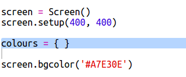
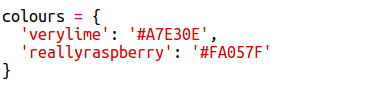
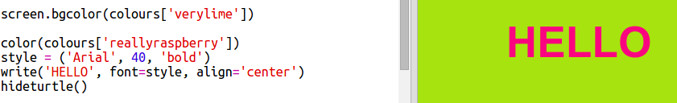

## Um dicionário de cores

Usar códigos de cores hexadecimais é realmente flexível, mas eles são difíceis de lembrar.

Como você provavelmente já sabe, um dicionário permite que você procure uma palavra e veja seu significado. Em Python, um dicionário é ainda mais flexível do que isso - ele permite que você procure um valor para qualquer 'chave' no dicionário.

Vamos criar um dicionário para mapear de nomes de cores amigáveis ​​(chaves) para códigos hexadecimais (valores) compatíveis com computadores.

+ Um dicionário está contido em chaves.
    
    Crie um dicionário vazio chamado `cores`:
    
    

+ Escolha nomes legais para suas cores e edite a linha `colors =` para adicionar entradas ao dicionário para elas.
    
    Aqui está um exemplo de dicionário de cores:
    
    
    
    Dois-pontos `:` separam a chave (nome da cor) do valor (código hexadecimal). Você precisa de uma vírgula `,` entre cada par chave: valor no dicionário.

+ Agora você não precisa se lembrar dos códigos hexadecimais, você pode apenas procurá-los no dicionário.
    
    Adapte o seguinte código para usar seus nomes de cores:
    
    
    
    A chave vai entre colchetes '[]' após o nome do dicionário.

+ Agora você pode atualizar seu código para procurar cores no dicionário:
    
    

+ Teste seu código para garantir que seu texto ainda seja exibido corretamente.