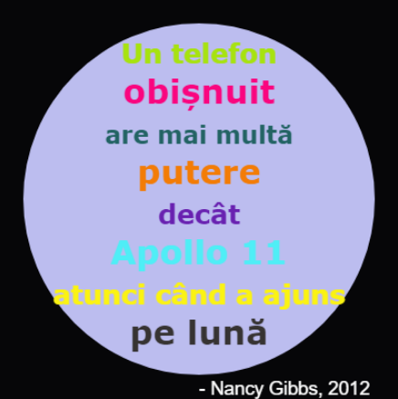

## Introducere

În acest proiect, vei crea un dicționar de culori care va transforma coduri de culori greu de ținut minte în nume prietenoase.

  <iframe src="https://trinket.io/embed/python/dc1f3efe8c?outputOnly=true&start=result" width="600" height="500" frameborder="0" marginwidth="0" marginheight="0" allowfullscreen>
  </iframe>
  

### Informații suplimentare pentru liderii de club

Dacă trebuie să printezi acest proiect, folosește [versiunea printabilă](https://projects.raspberrypi.org/ro-RO/projects/colourful-creations/print).

--- collapse ---
---
title: Note pentru liderul de club
---

## Introducere:

Acest proiect introduce dicționare prin crearea unui dicționar care mapează coduri hexazecimale de culori la nume mai ușor de reținut și folosit. Codurile culorilor sunt apoi preluate din dicționar și folosite pentru a crea un afiș colorat.

## Resurse online

**Acest proiect folosește Python 3.** Recomandăm folosirea unui [trinket](https://trinket.io/) pentru a scrie cod în Python online. Proiectul conține următoarele Trinket-uri:

* [Punctul de start pentru „Creații colorate” -- jumpto.cc/python-new](http://jumpto.cc/python-new)

Există, de asemenea, un trinket care conține un exemplu de soluție pentru provocări:

* [„Creații colorate” complet -- trinket.io/python/41a99e668b](https://trinket.io/python/dc1f3efe8c)

## Resurse offline

Acest proiect poate fi [finalizat offline](https://www.codeclubprojects.org/en-GB/resources/python-working-offline/) dacă se dorește. Poți accesa resursele proiectului dând click pe link-ul „Materiale pentru proiect”. Link-ul conține o secțiune „Resursele proiectului” care include resurse de care copiii vor avea nevoie pentru finalizarea proiectului offline. Asigură-te că fiecare copil are acces la câte o copie din aceste resurse. Secțiunea include următoarele fișiere:

* colourful-creations/colourful-creations.py

De asemenea, poți găsi o versiune finalizată a provocărilor din acest proiect în secțiunea „Resurse pentru liderul de club”, care conține:

* colourful-creations-finished/colourful-creations.py

(Toate resursele de mai sus se pot descărca ca fișiere `.zip` pentru proiect și pentru lideri de club.)

## Obiective de învățare

* Dicționare - creare și căutare;
* Turtle graphics - text, fonturi și culori;

Acest proiect acoperă elemente din următoarele domenii ale curriculumului [Raspberry Pi Digital Making](http://rpf.io/curriculum):

* [Folosește elemente de bază din programare pentru a crea programe simple.](https://www.raspberrypi.org/curriculum/programming/creator)

* [Proiectarea elementelor grafice 2D și 3D de bază.](https://www.raspberrypi.org/curriculum/design/creator)

## Provocări

* Mai multe culori! Folosește un website care are un selector de culori pentru a găsi mai multe coduri hexazecimale pentru culori, iar apoi adaugă-le într-un dicționar. 
* Creează un afiș - Creează un dicționar cu o paletă personalizată de culori pentru a-l folosi în crearea unui afiș folosind Turtle graphics. 

## Întrebări frecvente

* Este recomandată reamintirea copiilor despre adăugarea unei virgule ',' la sfârșitul fiecărei culori din dicționar. 

--- /collapse ---

--- collapse ---
---
title: Materiale pentru proiect
---

## Resursele proiectului

* [fișier .zip care conține toate resursele proiectului](resources/colourful-creations-project-resources.zip)
* [Trinket online gol pentru Python](http://jumpto.cc/python-new)
* [Fișier offline gol pentru Python](resources/new-new.py)

## Resurse pentru liderul de club

* [fișier .zip care conține toate resursele proiectului, finalizate](resources/colourful-creations-volunteer-resources.zip)
* [Proiect Trinket online, finalizat](https://trinket.io/python/dc1f3efe8c)
* [colourful-creations-finished/colourful-creations.py](resources/colourful-creations-finished-colourful-creations.py)

--- /collapse ---