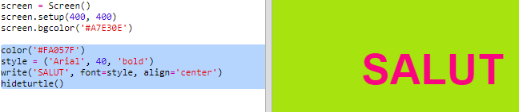

## Folosind coduri de culori hexazecimale

Python turtle are culori predefinite cum ar fi „red” și „white”, dar poți de asemenea să folosești coduri de culori hexazecimale (s-ar putea să le fi întâlnit în cursul de HTML & CSS).

+ Deschide un șablon Trinket nou pentru Python: <a href="http://jumpto.cc/python-new" target="_blank">jumpto.cc/python-new</a>.

+ Adaugă următorul cod de configurare pentru folosirea turtle:
    
    
    
    Observă faptul că ai folosit un nume de culoare: „white”.

+ Turtle are o listă de nume de culori pe care le poți folosi, dar uneori vei vrea să folosești propriile tale culori. Turtle permite, de asemenea, folosirea de coduri de culori hexazecimale.
    
    Deschide <a href="http://jumpto.cc/colour-picker" target="_blank">jumpto.cc/colour-picker</a> și alege o culoare care îți place. Găsește-i codul hexazecimal care începe cu „#”, cum ar fi „#A7E30E”.

+ Copiază codul hexadecimal, inclusiv hashtag-ul, prin selectarea acestuia urmată de click dreapta și Copiază, sau de combinația de taste Ctrl + C.

+ Acum schimbă linia de cod care setează culoarea ecranului pentru a folosi culoarea ta. De exemplu:
    
    
    
    Poți folosi click-dreapta și Lipire sau Ctrl + V pentru a lipi codul tău hexazecimal în trinket.

+ Alege alt cod de culoare hexazecimal și folosește-l pentru a crea text colorat:
    
    
    
    Nu trebuie să folosești fontul „Arial”. Poți să încerci „Verdana”, „Times” sau „Courier”.
    
    „40” este mărimea fontului, care poate de asemenea fi schimbată.

+ Încearcă culori diferite până când găsești două care îți plac și care arată bine împreună.