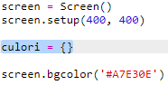
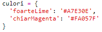

## Un dicționar de culori

Folosirea codurilor de culori hexazecimale este foarte flexibilă, dar ele sunt greu de reținut.

După cum probabil știi deja, un dicționar permite căutarea unui cuvânt ca să afli ce înseamnă. În Python, un dicționar este și mai flexibil decât atât - permite căutarea unei valori pentru orice „cheie” din dicționar.

Hai să creăm un dicționar pentru a mapa nume de culori ușor accesibile oamenilor (chei) la coduri hexazecimale înțelese de computer (valori).

+ Un dicționar este conținut între acolade.
    
    Creează un dicționar gol numit `culori`:
    
    

+ Alege nume cool pentru culorile tale și editează linia `culori =` pentru a adăuga intrări în dicționar.
    
    Iată un exemplu de dicționar de culori:
    
    
    
    Cele două puncte `:` separă cheia (numele culorii) de valoarea acesteia (codul hexazecimal.) Ai nevoie de o virgulă `,` între fiecare pereche cheie:valoare în dicționar.

+ Acum nu mai trebuie să reții codurile hexazecimale. Le poți căuta direct în dicționar.
    
    Adaptează următorul cod pentru a folosi numele culorilor tale:
    
    
    
    Cheia merge înăuntrul parantezelor pătrate „[ ]” după numele dicționarului.

+ Acum îți poți actualiza codul pentru a căuta culori în dicționar:
    
    

+ Testează-ți codul pentru a te asigura că textul încă este afișat corect.