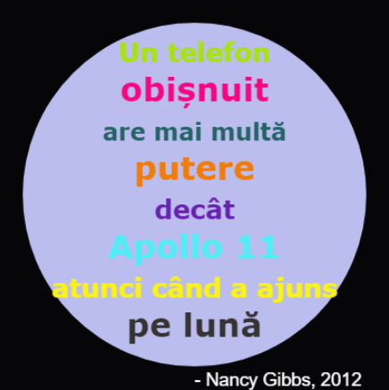

\--- challenge \---

## Provocare: Creează un afiș

Designerii creează, de obicei, o paletă de culori care se potrivesc bine împreună pentru o anumită temă cum ar fi deșertul sau spațiul.

Poți să creezi un nou proiect în Python care folosește un dicționar pentru o paletă de culori cu o anumită tematică? Ai putea să alegi toamna, pădurea, marea, Crăciunul, înghețata, culorile echipei tale preferate sau orice idee de-a ta.

Creează un afiș folosind dicționarul tău pentru paleta de culori.

Poți, de asemenea, să folosești alte comenzi turtle pe care le știi cum ar fi `forward`, `right`, `left`, `penup` și `pendown`.

Poate ai putea să adaugi un chenar la afișul tău?

Alte comenzi turtle folositoare:

+ `circle(50)` desenează conturul unui cerc de rază 50.
+ `dot(100)` desenează un cerc umplut cu un diametru de 100. 

Iată un exemplu:

\--- /challenge \---