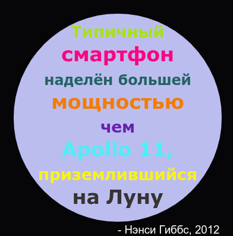

## Введение

В этом проекте ты создашь словарь цветов, в котором трудно запоминаемые цветовые коды будут иметь дружественные имена.

  <iframe src="https://trinket.io/embed/python/97822f48b7?outputOnly=true&start=result" width="600" height="500" frameborder="0" marginwidth="0" marginheight="0" allowfullscreen>
  </iframe>
  

### Дополнительная информация для руководителей клубов

Если вам нужно распечатать этот проект, пожалуйста, используйте [Версию для печати](https://projects.raspberrypi.org/en/projects/colourful-creations/print).

## \--- collapse \---

## title: Заметки для руководителя клуба

## Введение:

В этом проекте ты познакомишься со словарями, создав словарь, который отображает дружелюбные названия цветов в их шестнадцатеричные коды (hex-коды). Коды цветов затем ищутся в словаре и используются для создания красочного плаката.

## Интернет-ресурсы

**В этом проекте используется Python 3.** Мы рекомендуем использовать [trinket](https://trinket.io/), чтобы программировать на Python онлайн. В этом проекте используются следующие trinket-ы:

* [Стартовый проект «Красочные творения» — jumpto.cc/python-new](http://jumpto.cc/python-new)

Имеется также trinket, содержащий пример решения для задач:

* [Завершённый проект «Красочные творения» — trinket.io/python/41a99e668b](https://trinket.io/python/97822f48b7)

## Оффлайн ресурсы

Этот проект может быть [завершён в автономном режиме](https://www.codeclubprojects.org/en-GB/resources/python-working-offline/), если это предпочтительнее. Вы можете получить доступ к ресурсам этого проекта, щёлкнув в нём ссылку «Материалы проекта». Эта ссылка содержит раздел «Ресурсы проекта», включающий ресурсы, которые понадобятся детям, чтобы завершить этот проект в режиме оффлайн (автономном режиме). Убедитесь, что у каждого ребёнка есть доступ к копии этих ресурсов. Этот раздел содержит следующие файлы:

* colourful-creations/colourful-creations.py

You can also find a completed version of this project's challenges in the 'Club leader resources' section, which contains:

* colourful-creations-finished/colourful-creations.py

(Все вышеперечисленные ресурсы также можно загрузить как файлы project и volunteer `.zip`.)

## Цели обучения

* Словари — создание и получение значений;
* Черепашья графика — текст, шрифты и цвета;

Этот проект затрагивает элементы из следующих глав [Учебного курса по цифровому изготовлению с Raspberry Pi](http://rpf.io/curriculum):

* [Используйте базовые конструкции программирования для создания простых программ.](https://www.raspberrypi.org/curriculum/programming/creator)

* [Спроектируйте 2D и 3D ресурсы.](https://www.raspberrypi.org/curriculum/design/creator)

## Задачи

* Ещё больше цветов! — Используй веб-сайт для выбора цвета, чтобы найти шестнадцатеричные коды для большего количества цветов и добавить их в словарь. 
* Создай плакат — создай собственный словарь для цветовой палитры и используй его и черепашью графику для создания плаката. 

## Частые Вопросы и Ответы (ЧаВО)

* Детям может потребоваться напоминание о запятой «,» в конце каждой записи словаря. 

\--- /collapse \---

## \--- collapse \---

## title: Материалы проекта

## Ресурсы проекта

* [.zip-файл, содержащий все ресурсы проекта](resources/colourful-creations-project-resources.zip)
* [Пустой trinket для Python (онлайн)](http://jumpto.cc/python-new)
* [Пустой файл для Python (оффлайн)](resources/new-new.py)

## Ресурсы для руководителя клуба

* [.zip-файл, содержащий все ресурсы завершённого проекта](resources/colourful-creations-volunteer-resources.zip)
* [Завершённый проект в trinket (онлайн)](https://trinket.io/python/97822f48b7)
* [colourful-creations-finished/colourful-creations.py](resources/colourful-creations-finished-colourful-creations.py)

\--- /collapse \---