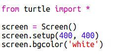
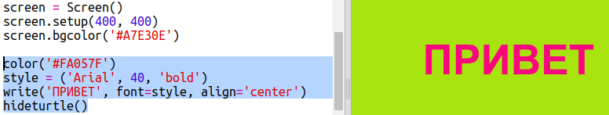

## Использование шестнадцатеричных цветовых кодов

Питоновская черепашка имеет встроенные цвета такие, как «red» (красный) и «white» (белый), но ты можешь также использовать шестнадцатеричные цветовые коды (возможно, ты уже работал с ними в курсах по HTML и CSS).

+ Открой шаблон пустого проекта для Python в trinket: <a href="http://jumpto.cc/python-new" target="_blank">jumpto.cc/python-new</a>.

+ Добавь следующий код для настройки черепашки:
    
    
    
    Заметь, что ты использовал цвет с именем «white» (белый).

+ Черепашка имеет встроенный список с именами цветов, которые ты можешь использовать, однако иногда ты можешь захотеть задать свой собственный цвет. Черепашка также позволяет тебе использовать шестнадцатеричные (hex) цветовые коды.
    
    Открой <a href="http://jumpto.cc/colour-picker" target="_blank">jumpto.cc/colour-picker</a> и выбери понравившийся тебе цвет. Найди его шестнадцатеричный код, который начинается с «#», к примеру, «#A7E30E».

+ Скопируй шестнадцатеричный код вместе с хешем (символом #). Сначала выдели код, затем кликни по нему правой кнопкой и выбери «Копировать», либо же нажми Ctrl-C.

+ Теперь измени строчку кода, которая задаёт цвет экрана, на свой собственный цвет. Например:
    
    
    
    Ты можешь кликнуть правой кнопкой мыши и выбрать команду «Вставить» или же использовать Ctrl-V, чтобы вставить твой шестнадцатеричный код в тринкет.

+ Выбери другой шестнадцатеричный цветовой код и используй его, чтобы раскрасить текст:
    
    
    
    Тебе необязательно использовать шрифт «Arial», ты также можешь попробовать «Verdana», «Times» или «Courier».
    
    «40» — это размер шрифта. Как и раннее, ты можешь попробовать задать свой размер.

+ Попробуй разные цвета, пока не получишь такие два, которые тебе действительно нравятся и которые хорошо смотрятся вместе.