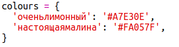
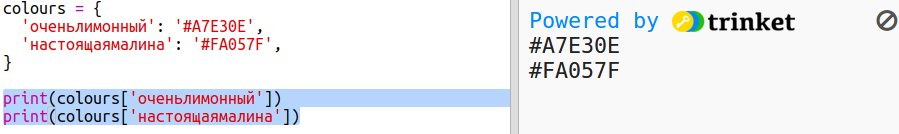

## Словарь цветов

Использование шестнадцатеричных цветовых кодов — действительно гибкое решение, но их трудно запоминать.

Как ты наверное знаешь, словарь позволяет тебе подсматривать слова и узнавать их значения. Словарь (dictionary) в Python ещё более гибок — он позволяет тебе подсматривать в нём значение для любого «ключа» (key).

Давай создадим словарь для отображения удобных для человека цветовых имён (ключи) в удобные для компьютера шестнадцатеричные коды (значения).

+ Словарь заключается в фигурные скобки.
    
    Создай пустой словарь с именем `colours` (цвета):
    
    

+ Придумай необычные имена для твоих цветов и отредактируй строку с `colours =`, чтобы добавить для них записи в словаре.
    
    Вот пример цветового словаря:
    
    
    
    Двоеточие `:` отделяет ключ (имя цвета) от значения (шестнадцатеричный код). Нужно ставить запятую `,` между каждыми парами ключ:значение в словаре.

+ Теперь тебе не нужно запоминать шестнадцатеричные коды, ты можешь просто подсмотреть их в словаре.
    
    Адаптируй следующий код, чтобы использовать твои названия цветов:
    
    
    
    Ключ вводится в квадратные скобки «[]» после названия словаря.

+ Теперь ты можешь обновить свой код и добавить подсматривание цветов в словаре:
    
    

+ Протестируй свой код, чтобы убедиться, что твой текст по-прежнему отображается правильно.