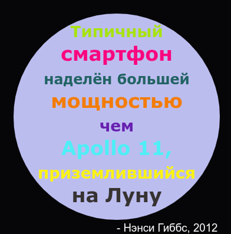

\--- challenge \---

## Задача: создай плакат

Дизайнеры часто создают «палитру» цветов, которая хорошо сочетается с определенной темой, такой как пустыня или космос.

Можешь ли ты создать новый проект на Python, в котором словари используются в качестве тематических цветовых палитр. Ты можешь выбрать осень, лес, море, Рождество, мороженое, цвета своей любимой спортивной команды или придумать свою тему для палитры.

Создай плакат, используя свой словарь в качестве цветовой палитры.

Ты также можешь использовать другие известные тебе команды черепашки такие как: `forward` (вперёд), `right` (вправо), `left` (влево), `penup` (поднять перо) и `pendown` (опустить перо).

Можешь ли ты добавить рамку для своего плаката?

Другие полезные команды черепашки:

+ `circle(50)` рисует контур круга с радиусом 50.
+ `dot(100)` рисует заполненный круг с диаметром 100. 

Вот тебе пример:

\--- /challenge \---