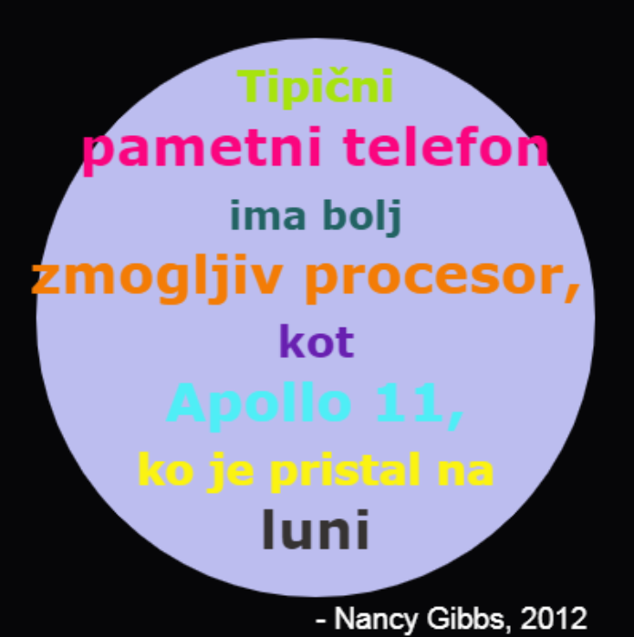

## Uvod

V tem projektu boš ustvaril slovar barv, ki bo opisal težko zapomnljive barvne kode kot razumljiva imena.

  <iframe src="https://trinket.io/embed/python/97822f48b7?outputOnly=true&start=result" width="600" height="500" frameborder="0" marginwidth="0" marginheight="0" allowfullscreen>
  </iframe>
  

### Dodatne informacije za vodje klubov

Za tiskanje tega projekta, prosimo uporabite [tiskalniku prijazno različico](https://projects.raspberrypi.org/en/projects/colourful-creations/print).

## \--- collapse \---

## title: Opombe za vodje klubov

## Uvod:

Ta projekt je namenjen uvajanju v slovarje, tako da ustvarimo slovar, ki poveže človeku razumljiva imena barv s šestnajškimi kodami. Barvne kode se nato poiščejo v slovarju, z njimi pa se ustvari barvit plakat.

## Spletni viri

**Ta projekt uporablja Python 3.** Priporočamo uporabo [trinket-a](https://trinket.io/) za pisanje Python kode na spletu. Ta projekt uporablja naslednje trinket-e:

* [Izhodišče za 'Barvite kreacije' - jumpto.cc/python-new](http://jumpto.cc/python-new)

Na voljo je tudi trinket, ki vsebuje rešen primer izzivov:

* [Zaključene 'Barvite kreacije'](https://trinket.io/python/97822f48b7)

## Nespletni viri

Če želimo, lahko ta projekt [zaključimo brez povezave na splet](https://www.codeclubprojects.org/en-GB/resources/python-working-offline/). Do virov tega projekta je mogoče dostopati s klikom na povezavo 'Materiali projekta'. Ta povezava vsebuje razdelek 'Viri projekta', ki vključuje vire, ki jih bodo otroci potrebovali za dokončanje tega projekta brez spletne povezave. Poskrbite, da ima vsak otrok dostop do kopije teh virov. Ta razdelek vključuje naslednje datoteke:

* colourful-creations/colourful-creations.py

You can also find a completed version of this project's challenges in the 'Club leader resources' section, which contains:

* colourful-creations-finished/colourful-creations.py

(Vsi zgoraj navedeni projektni viri in viri za prostovoljce se lahko prenesejo tudi kot `.zip` datoteke.)

## Učni cilji

* Slovarji - ustvarjanje in iskanje vrednosti;
* Želvja grafika - besedilo, pisave in barve;

Ta projekt zajema elemente iz naslednjih delov [učnega načrta Raspberry Pi za digitalno ustvarjanje](http://rpf.io/curriculum):

* [Uporaba osnovnih programskih konstruktov za ustvarjanje preprostih programov.](https://www.raspberrypi.org/curriculum/programming/creator)

* [Oblikovanje osnovnih 2D in 3D sredstev.](https://www.raspberrypi.org/curriculum/design/creator)

## Izzivi

* Več barv! - S pomočjo spletne strani za izbiranje barv najdi šestnajstiške kode in jih dodaj v slovar. 
* Ustvarjanje plakata - ustvari slovar z lastno paleto in ga uporabi za ustvarjanje plakata s pomočjo želvje grafike. 

## Pogosto zastavljena vprašanja

* Otroke bo morda potrebno opozarjati na vejico ',' ob koncu vsakega vnosa v slovar. 

\--- /collapse \---

## \--- collapse \---

## naslov: Materiali projekta

## Viri projekta

* [.zip datoteka, ki vsebuje vse vire projekta](resources/colourful-creations-project-resources.zip)
* [Prazen Python trinket, ki potrebuje spletno povzavo](http://jumpto.cc/python-new)
* [Prazna Python datoteka, ki deluje brez povezave spletom](resources/new-new.py)

## Viri za vodje klubov

* [.zip datoteka, ki vsebuje vse dokončane vire projekta](resources/colourful-creations-volunteer-resources.zip)
* [Na spletu dokončan trinket projekt](https://trinket.io/python/97822f48b7)
* [colourful-creations-finished/colourful-creations.py](resources/colourful-creations-finished-colourful-creations.py)

\--- /collapse \---