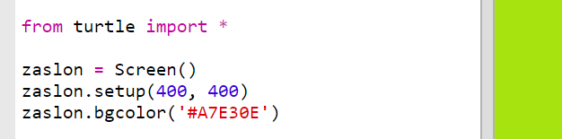

## Uporaba šetnajstiških kod

Python želva ima predefinirane barve, kot so 'red' za rdečo in 'white' za belo, vendar je mogoče uporabljati tudi šetnajstiške kode barv (to ste morda že videli v teh HTML & CSS tečajih).

+ Odpri prazen Python trinket: <a href="http://jumpto.cc/python-new" target="_blank">jumpto.cc/python-new</a>.

+ Za uporabo želvje grafike uporabi naslednjo namestitveno kodo:
    
    
    
    Bodi pozoren na to, da si uporabil vnaprej poimenovano barvo: 'white'.

+ Želvja grafika ima seznam barv, ki jih lahko uporabiš, včasih pa bi rad izbral tudi katero drugo barvo. Želva v ta namen omogoča rabo šestnajstiške barvne kodo.
    
    Odpri <a href="http://jumpto.cc/colour-picker" target="_blank">jumpto.cc/colour-picker</a> in izberi barvo, ki ti je všeč. Poišči njeno šestnajstiško kodo. Ta se začne z '#', kot npr. '#A7E30E'.

+ Skopiraj to šestnajstiško kodo skupaj z lojtro, ki stoji pred njo, tako da jo označiš in potem z desnim klikom miške izbereš Kopiraj ali pa uporabiš tipki Ctrl-C.

+ Sedaj spremeni vrstico kode, ki določi barvo zaslona, tako da bo uporabljena tvoja barva. Na primer:
    
    
    
    Da bi prilepil svojo šestnajstiško kodo v trinket, lahko uporabiš tudi kombinacijo desnega klika in opcije Prilepi ali tipki Ctrl-V.

+ Izberi drugo šestnajstiško kodo in jo uporabi pri ustvarjanju barvnega besedila:
    
    
    
    Ni ti potrebno uporabljati 'Arial' pisave, lahko preskusiš tudi pisave 'Verdana', 'Times' ali 'Courier'.
    
    Velikost pisave je '40', lahko pa poskusiš spremeniti tudi to.

+ Preizkusi različne barve, dokler ne najdeš dveh, ki skupaj delujeta lepo.