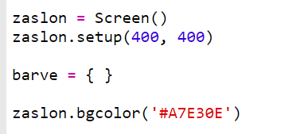
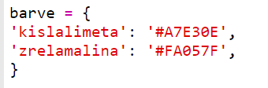
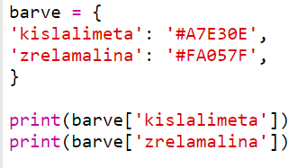
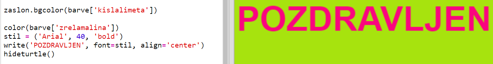

## Slovar barv

Raba šestnajstiških barvnih kod je res fleksibilna, vendar si jih je težko zapomniti.

Kot verjetno že veš, ti slovar omogoča, da poiščeš neko besedo in pogledaš, kaj pomeni. V Pythonu so slovarji še bolj fleksibilni, saj omogočajo iskanje vrednosti za katerokoli 'geslo' v slovarju.

Ustvari slovar, ki povezuje ljudem prijazna barvna imena (gesla) z računalnikom prijaznimi šestnajstiškimi kodami (vrednosti).

+ Slovar je vsebovan v zavitih oklepajih.
    
    Ustvari prazen slovar in ga poimenuj `barve`:
    
    

+ Za svoje barve določi zanimiva imena in jih vnesi v slovar z urejanjem vrstice `barve =`.
    
    Tukaj se nahaja primer slovarja barv:
    
    
    
    Geslo (ime barve) in vrednost (šestnajstiška vrednost) sta ločena z dvopičjem `:`. Med vsakim parom geslo:vrednost mora stati vejica `,`.

+ Ni si potrebno zapomniti šestnajstiških kod, saj jih lahko poiščeš v slovarju.
    
    Da bi uporabil svoja imena za barve, prilagodi naslednjo kodo:
    
    
    
    Geslo mora biti zapisano med oglatima oklepajima '[]', za imenom slovarja.

+ Sedaj lahko nadgradiš kodo, da bo iskala barve v tvojem slovarju:
    
    

+ Preizkusi svojo kodo in se prepričaj, da se besedilo še vedno pravilno prikazuje.