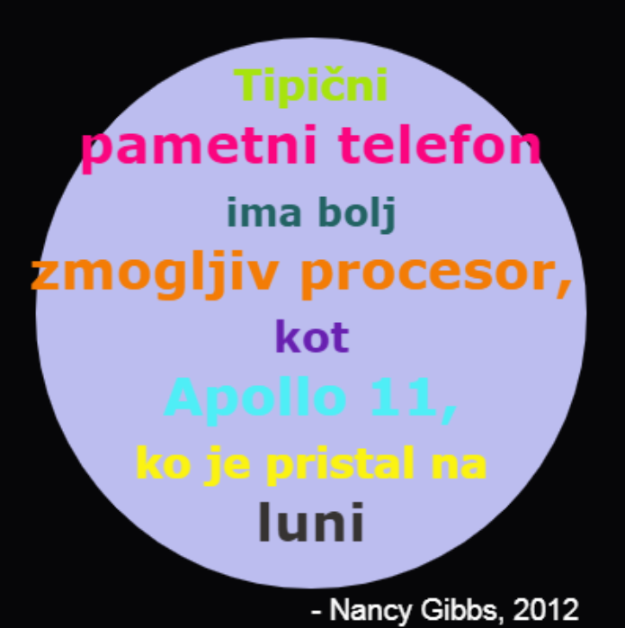

--- challenge ---

## Izziv: Ustvari plakat

Oblikovalci pogosto ustvarjajajo barvne 'palete', ki dobro ustrezajo določeni tematiki, kot sta npr. puščava ali vesolje.

Ali lahko ustvariš nov Python projekt, ki za tematsko barvno paleto uporablja slovar? Lahko bi denimo izbral jesen, gozd, morje, božič, sladoled, barve svoje najljubše ekipe ali pa si izmisliš kakšno lastno idejo.

Ustvari plakat z uporabo slovarja z lastno barvno paleto.

Lahko uporabiš tudi druge ukaze želvje grafike, ki jih poznaš, kot so `forward`, `right`, `left`, `penup` in `pendown`.

Morda bi svojemu plakat dodal še rob?

Drugi uporabni ukaz za želvjo grafiko:

+ `circle(50)` nariše krog s polmerom 50.
+ `dot(100)` nariše zapolnjen krog s premerom 100. 

Tukaj je primer:

--- /challenge ---

***

Ta projekt so prevedli prostovoljci:

Arnold Marko

Zahvaljujoč prostovoljcem, lahko ljudem po vsem svetu omogočimo, da se učijo v svojem jeziku. S prostovoljnim prevajanjem nam lahko pomagate, da dosežemo več ljudi - več informacij na [rpf.io/translate](https://rpf.io/translate).