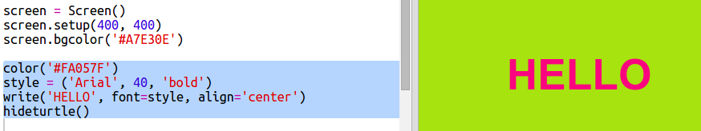

## Använda hex färgkoder

Python sköldpadda har fördefinierade färger som "röd" och "vit" men du kan också använda hex färgkoder (du kan ha sett dessa i HTML & CSS kursen.)

+ Öppna den tomma Python-mallen. Trinket: <a href="http://jumpto.cc/python-new" target="_blank">jumpto.cc/python-new</a>.

+ Lägg till följande inställningskod för att använda sköldpaddan:
    
    
    
    Observera att du använde en namngiven färg: "vit".

+ Turtle har en lista med färgnamn som du kan använda, men ibland vill du välja dina egna färger. Turtle kan du också använda hex färgkoder.
    
    Öppna <a href="http://jumpto.cc/colour-picker" target="_blank">jumpto.cc/colourpicker</a> och välj färg du vill ha. Hitta det hex-kod som börjar med en "#", till exempel "# A7E30E".

+ Kopiera hex-koden, inklusive hash, genom att markera den och högerklicka och välj Kopiera eller använd Ctrl-C.

+ Ändra nu koden som anger skärmfärgen för att använda din färg. Till exempel:
    
    
    
    Du kan högerklicka och klistra in eller Ctrl-V för att klistra in din hex-kod i pricket.

+ Välj en annan hex färgkod och använd den för att skapa färgad text:
    
    
    
    Du behöver inte använda teckensnittet 'Arial', du kan försöka 'Verdana', 'Times' eller 'Courier'.
    
    '40' är teckenstorleken, du kan försöka ändra det också.

+ Prova olika färger tills du får två som du gillar det ser bra ut tillsammans.