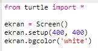

## Onaltılık renk kodlarını kullanma

Python turtle modülü, 'kırmızı' ve 'beyaz' gibi önceden tanımlanmış renklere sahiptir, ancak onaltılık renk kodlarını da kullanabilirsiniz (bunları HTML & CSS kursunda görmüş olmalısınız.)

+ Trinket'ta boş Python şablonunu açın: <a href="http://jumpto.cc/python-new" target="_blank">jumpto.cc/python-new</a>.

+ Turtle modülünü kullanmak için aşağıdaki ayarlama kodunu ekleyin:
    
    
    
    'Beyaz' adında bir renk kullandığınıza dikkat edin.

+ Turtle modülünde, kullanabileceğiniz renklerin bir isim listesi vardır, ancak bazen kendi renklerinizi seçmek istersiniz. Turtle modülü ayrıca onaltılık renk kodlarını kullanmanıza imkan sağlar.
    
    <a href="http://jumpto.cc/colour-picker" target="_blank">jumpto.cc/colour-picker</a> öğesini açın ve istediğiniz rengi seçin. Seçtiğiniz rengin, '#A7E30E' gibi '#' ile başlayan onaltılık kodunu bulun.

+ Başındaki diyez '#' işaretiyle birlikte onaltılık renk kodunu seçip, sağ tuşla 'Kopyala'ya tıklayın veya klavyenizden Ctrl-C tuş ikilisine basın.

+ Şimdi renginizi kullanmak için ekran rengini ayarlayan kod satırını değiştirin. Örneğin:
    
    
    
    Onaltılık kodunuzu Trinket'a yapıştırmak için sağ tıklayıp Yapıştır veya Ctrl-V tuşlarını kullanabilirsiniz.

+ Başka bir onaltılık renk kodu seçin ve renkli metin oluşturmak için kullanın:
    
    
    
    'Arial' yazı tipini kullanmak zorunda değilsiniz, 'Verdana', 'Times' veya 'Courier' deneyebilirsiniz.
    
    '40' yazı tipinin boyutudur, onu da değiştirmeyi deneyebilirsiniz.

+ Birlikte güzel gözüküp hoşunuza gidecek iki tane renk olana kadar farklı renkler deneyin.