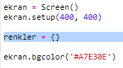
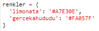
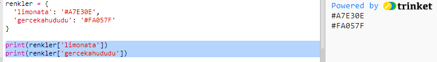
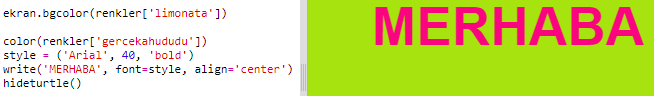

## Bir Renk Sözlüğü

Onaltılık renk kodlarını kullanmak gerçekten esnektir ancak hatırlaması zordur.

Muhtemelen zaten bildiğiniz gibi sözlükler, bir kelimeye bakmanıza ve bunun anlamını görmenize izin verir. Python'da sözlük bundan daha da esnektir - sözlükteki herhangi bir 'anahtar' için bir değer aramanıza izin verir.

Hadi şimdi insan-dostu renk isimleriyle (anahtar), bilgisayar-dostu onaltılık kodları (değer) eşleştireceğimiz bir sözlük yaratalım.

+ Sözlükler, süslü parantezin {} içinde bulunurlar.
    
    `renkler` adında boş bir sözlük yaratın:
    
    

+ Renkleriniz için havalı isimler seçin ve sözlüğe bunların girdilerini eklemek için `renkler =` satırını düzenleyin.
    
    Örnek bir renk sözlüğü:
    
    
    
    İki nokta `:` işareti anahtarı (renk adı), değerden (onaltılık kod) ayırır. Sözlüğünüzdeki her anahtar:değer çiftinin arasına bir virgül işareti`,` koymanız gerekir.

+ Artık onaltılık kodları hatırlamanıza gerek yok, bunları sadece sözlükten aratabilirsiniz.
    
    Renk adlarınızı kullanmak için aşağıdaki kodu uyarlayın:
    
    
    
    Anahtar, sözlüğün isminden sonraki köşeli parantezin '[]' içinde yer alır.

+ Artık, sözlükteki renkleri aramak için kodunuzu güncelleyebilirsiniz:
    
    

+ Metninizin hala doğru görüntülendiğinden emin olmak için kodunuzu test edin.