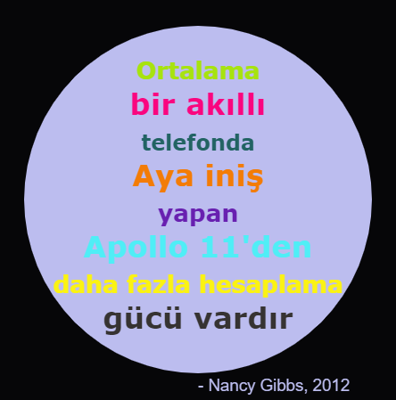

--- challenge ---

## Meydan Okuma: Bir poster yaratın

Tasarımcılar genellikle çöl veya uzay gibi belirli bir tema için birlikte güzel gözüken bir renk 'paleti' oluştururlar.

Python'da temalı bir renk paleti kullanan yeni bir sözlük projesi oluşturabilir misiniz. Sonbahar, orman, deniz, yılbaşı, dondurma, en sevdiğiniz spor takımının renklerini veya kendi fikrinizi seçebilirsiniz.

Renk paleti sözlüğünüzü kullanarak bir poster oluşturun.

Ayrıca `forward`, `right`, `left`, `penup`, `pendown` gibi bildiğiniz diğer turtle komutlarını da kullanabilirsiniz.

Belki posterinize bir kenarlık da ekleyebilirsiniz?

Diğer faydalı turtle komutları:

+ `circle(50)` yarıçapı 50 birim olan bir çember çizer.
+ `dot(100)` 100 birim çapında içi dolu bir daire çizer. 

İşte bir örnek:

--- /challenge ---

***
Bu proje gönüllüler tarafından tercüme edildi:

Volkan Çevik

Berkan Ali Sefil

Dünyanın dört bir yanındaki insanlara anadilinde öğrenme şansı verebildiğimiz için gönüllülere teşekkür ederiz. Daha fazla gönüllü tercümana ulaşmamızda bize yardımcı olabilirsiniz - [rpf.io/translate](https://rpf.io/translate) adresinden daha fazla bilgiye ulaşabilirsiniz.