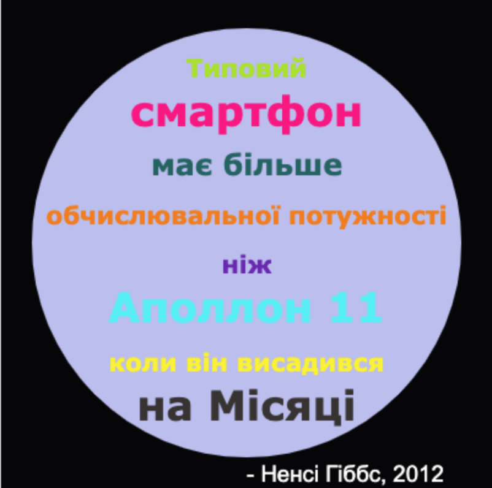

## Вступ

У цьому проєкті ти створиш словник кольорів, який пов'язуватиме важкі для запам'ятовування коди кольорів зі зрозумілими назвами.

  <iframe src="https://trinket.io/embed/python/97822f48b7?outputOnly=true&start=result" width="600" height="500" frameborder="0" marginwidth="0" marginheight="0" allowfullscreen>
  </iframe>
  

### Додаткова інформація для керівників клубу

Якщо вам потрібно роздрукувати цей проєкт, використовуйте [Версію для друку](https://projects.raspberrypi.org/en/projects/colourful-creations/print).

## \--- collapse \---

## title: Нотатки керівника клубу

## Вступ:

Цей проєкт знайомить зі словниками через створення словника, який пов'язує зрозумілі назви кольорів та їх шістнадцяткові коди. Коди кольорів потім шукаються у словнику та використовуються для створення кольорового постера.

## Онлайн Ресурси

**Цей проєкт використовує Python 3.** Ми рекомендуємо використовувати [trinket](https://trinket.io/) для написання Python коду онлайн. Цей проєкт містить наступні ресурси Trinket:

* [Початковий проєкт 'Барвисті витвори': jumpto.cc/python-new](http://jumpto.cc/python-new)

Також існує проєкт Trinket, що містить зразки вирішення завдань:

* [Готовий проєкт 'Барвисті витвори': trinket.io/python/41a99e668b](https://trinket.io/python/97822f48b7)

## Офлайн Ресурси

При бажанні, цей проєкт може бути [виконаний офлайн](https://www.codeclubprojects.org/en-GB/resources/python-working-offline/). Ви можете отримати доступ до ресурсів проєкту, натиснувши на посилання "Матеріали проєкту". Це посилання містить розділ "Ресурси проєкту", який включає в себе ресурси, що будуть потрібні дітям, аби завершити проєкт офлайн. Переконайтеся, що кожна дитина має доступ до копії цих ресурсів. Цей розділ містить наступні файли:

* colourful-creations/colourful-creations.py

Також, ви можете знайти завершену версію завдань цього проєкту в розділі 'Ресурси керівника клубу', який містить:

* colourful-creations-finished/colourful-creations.py

(Всі вищезгадані ресурси доступні для завантаження як `.zip`-файли проєкта та керівника гуртка.)

## Цілі навчання

* Словники - створення та пошук значень;
* Графіка tutle - текст, шрифти і кольори;

Цей проєкт охоплює елементи з наступних напрямків [Електронного навчального плану Raspberry Pi](http://rpf.io/curriculum):

* [Використання базових конструкцій програмування для створення простих програм.](https://www.raspberrypi.org/curriculum/programming/creator)

* [Розробка базових 2D та 3D ресурсів.](https://www.raspberrypi.org/curriculum/design/creator)

## Завдання

* Більше кольорів! - Використовуйте веб-сайт вибору кольорів, щоб знайти шістнадцяткові коди для більшої кількості кольорів та додайте їх до словника. 
* Створення постера - Створіть власний словник із кольоровою палітрою та використовуйте його для створення постера з використанням графіки turtle. 

## Найбільш поширені запитання

* Дітям можуть знадобитися нагадування про коми ',' в кінці кожного запису у словнику. 

\--- /collapse \---

## \--- collapse \---

## title: Матеріали проєкту

## Ресурси проєкту

* [.zip-файл, що містить всі ресурси проєкту](resources/colourful-creations-project-resources.zip)
* [Порожній онлайн проєкт Python Trinket](http://jumpto.cc/python-new)
* [Порожній офлайн файл Python](resources/new-new.py)

## Ресурси керівника клубу

* [.zip-файл, що містить всі завершені проєктні ресурси](resources/colourful-creations-volunteer-resources.zip)
* [Завершений онлайн проєкт Trinket](https://trinket.io/python/97822f48b7)
* [colourful-creations-finished/colourful-creations.py](resources/colourful-creations-finished-colourful-creations.py)

\--- /collapse \---