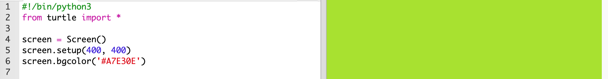
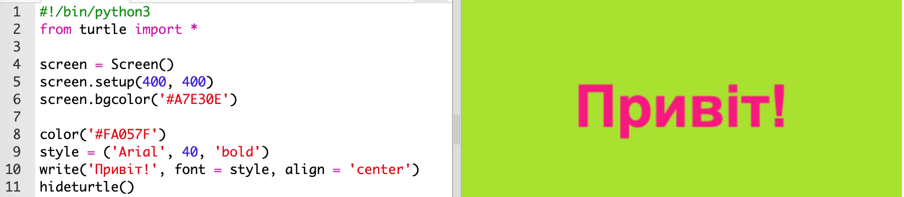

## Використання шестигранних кодів

Черепаха Python має попередньо встановлені кольори, такі як "червоний" та "білий", але ви також можете використовувати шістнадцяткові кольорові коди (можливо, ви побачили їх у курсі HTML & HTML).

+ Відкрийте пустий шаблон Python Брелок: <a href="http://jumpto.cc/python-new" target="_blank">jumpto.cc/python-new</a>.

+ Додайте наступний налаштований код для користування черепахою:
    
    
    
    Зверніть увагу, що ви використовували іменований колір: 'білий'.

+ Черепаха має список імен кольорів, які ви можете використовувати, але іноді ви хочете вибрати власні кольори. Черепаха також дозволяє використовувати шістнадцяткові колірні коди.
    
    Відкрийте <a href="http://jumpto.cc/colour-picker" target="_blank">jumpto.cc/colour-picker</a> і виберіть колір, який вам подобається. Знайдіть його шістнадцятковий код, який починається з "#", наприклад, "# A7E30E".

+ Скопіюйте шістнадцятковий код, включаючи хеш, виділіть його, а потім клацніть правою кнопкою миші та оберіть Копіювати або скористайтеся комбінацією клавіш Ctrl-C.

+ Тепер змініть рядок коду, який встановлює колір екрана, щоб використовувати колір. Наприклад:
    
    
    
    Ви можете використовувати клацання правою кнопкою миші та вставити або Ctrl-V, щоб вставити свій шестигранний код в брелок.

+ Виберіть інший шістнадцятковий колір та використайте його для створення кольорового тексту:
    
    
    
    Вам не потрібно використовувати шрифт Arial, ви можете спробувати "Verdana", "Times" або "Courier".
    
    '40' - це розмір шрифту, ви також можете спробувати змінити його.

+ Спробуйте різні кольори, поки не отримаєте двох, які вам дійсно подобаються, виглядайте добре разом.