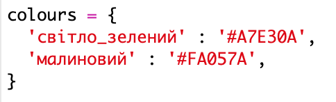
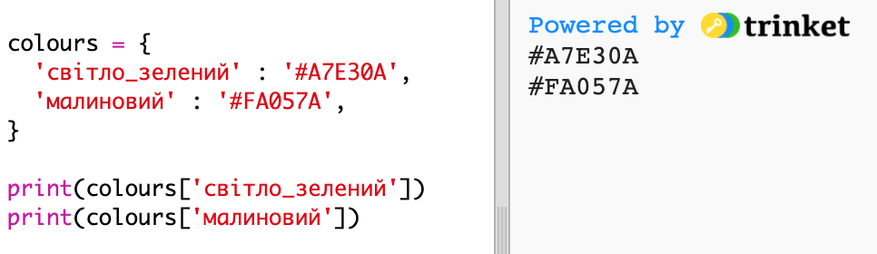
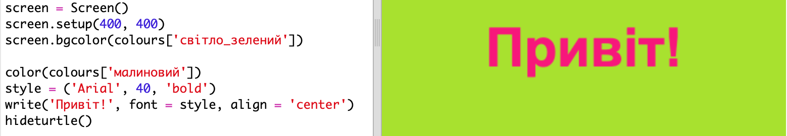

## Кольоровий словник

Використання шістнадцяткових кольорових кодів дійсно є гнучким, але вони важко запам'ятати.

Як ви, напевно, вже знаєте, словник дозволяє шукати слово і бачити його значення. У Python словник ще більш гнучкий, що - це дозволяє шукати значення для будь-якого "ключа" у словнику.

Давайте створимо словник для позначення кольорових імен (клавіш), які підійдуть людям, до шестигранних кодів (значень), доступних для роботи в комп'ютері.

+ Словник міститься в фігурних дужках.
    
    Створіть порожній словник з назвою `кольорів`:
    
    

+ Виберіть прості імена для ваших кольорів та відредагуйте `colors =` рядок, щоб додати записи до словника для них.
    
    Ось приклад словника кольорів:
    
    
    
    Колона `:` відокремлює ключ (ім'я кольору) від значення (шістнадцятковий код). Для кожної клавіші потрібна кома `,` : пари значення в словнику.

+ Тепер вам не потрібно пам'ятати про шістнадцяткові коди, ви можете просто подивитися їх у словник.
    
    Пристосувати наступний код, щоб використовувати ваші назви кольорів:
    
    
    
    Ключ у квадратних дужках "[]" після назви словника.

+ Тепер ви можете оновити свій код, щоб шукати кольори в словнику:
    
    

+ Перевірте свій код, щоб переконатися, що ваш текст все ще відображається правильно.