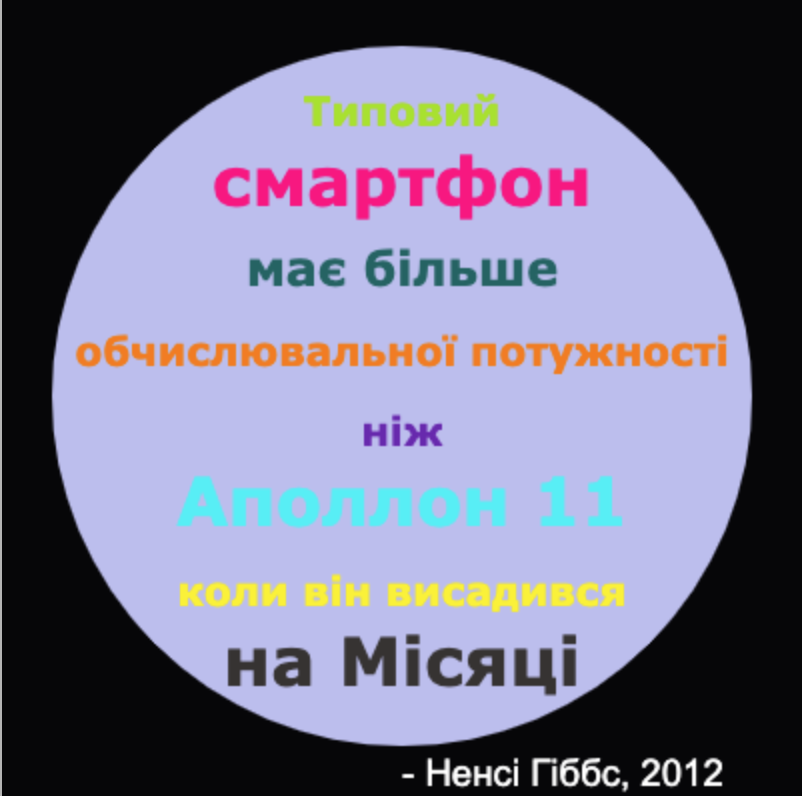

\--- challenge \---

## Завдання: Створи постер

Дизайнери часто створюють "палітру" кольорів, які добре виглядають разом для певної теми, наприклад, "пустеля" або "космос".

Чи можеш ти створити новий проєкт Python, який використовує словник для тематичної палітри кольорів? Ти можеш вибрати осінь, ліс, море, Різдво, морозиво, кольори тоєї улюбленої спортивної команди або придумати власну тему для палітри.

Створи постер, використовуючи свою палітру кольорів.

Ти також можеш використовувати інші відомі тобі команди turtle, такі як `forward` (вперед), `right` (праворуч), `left` (ліворуч), `penup` (підняти ручку) і `pendown` (опустити ручку).

Можливо ти додаси рамку до свого постера?

Інші корисні команди turtle:

+ `circle(50)` малює контур кола з радіусом 50.
+ `dot(100)` малює круг діаметром 100, заповнений певним кольором. 

Ось приклад:

\--- /challenge \---