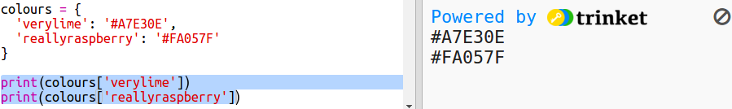

## Từ điển màu

Sử dụng mã màu hex thực sự linh hoạt nhưng chúng rất khó nhớ.

Như bạn có thể đã biết, một từ điển cho phép bạn tra cứu một từ, và thấy nó có ý nghĩa. Trong Python, một từ điển thậm chí còn linh hoạt hơn - nó cho phép bạn tìm kiếm một giá trị cho bất kỳ 'khóa' nào trong từ điển.

Hãy tạo một từ điển để ánh xạ từ các tên màu (phím) thân thiện với con người đến các mã hex (giá trị) thân thiện với máy tính.

+ Một từ điển được chứa trong dấu ngoặc nhọn.
    
    Tạo một từ điển rỗng gọi là `màu`:
    
    

+ Chọn tên mát cho màu của bạn và chỉnh sửa `màu =` dòng để thêm các mục vào từ điển cho chúng.
    
    Đây là một từ điển màu ví dụ:
    
    
    
    Dấu hai chấm `:` tách khóa (tên màu) khỏi giá trị (mã hex.) Bạn cần dấu phẩy `,` giữa mỗi cặp khóa: giá trị trong từ điển.

+ Bây giờ bạn không cần phải nhớ mã hex, bạn chỉ có thể tra cứu chúng trong từ điển.
    
    Điều chỉnh mã sau để sử dụng tên màu của bạn:
    
    
    
    Phím nằm bên trong dấu ngoặc vuông '[]' sau tên của từ điển.

+ Bây giờ bạn có thể cập nhật mã của mình để tìm kiếm các màu trong từ điển:
    
    

+ Kiểm tra mã của bạn để đảm bảo văn bản của bạn vẫn hiển thị chính xác.