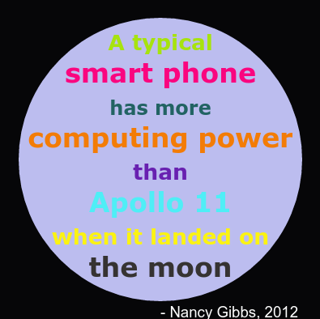

\--- thử thách \---

## Thách thức: Tạo một áp phích

Các nhà thiết kế thường tạo ra một 'bảng màu' các màu sắc hoạt động tốt với nhau cho một chủ đề cụ thể như sa mạc hoặc không gian.

Bạn có thể tạo một dự án Python mới sử dụng từ điển cho một bảng màu theo chủ đề không. Bạn có thể chọn mùa thu, rừng, biển, Giáng sinh, kem, màu sắc của đội thể thao yêu thích của bạn hoặc ý tưởng của riêng bạn.

Tạo một áp phích bằng cách sử dụng từ điển bảng màu của bạn.

Bạn cũng có thể sử dụng các lệnh rùa khác mà bạn biết như `về phía trước`, `phải`, `trái`, `penup` và `pendown`.

Có lẽ bạn có thể thêm một biên giới để áp phích của bạn?

Các lệnh rùa hữu ích khác:

+ `vòng tròn (50)` vẽ đường viền vòng tròn với bán kính 50.
+ `chấm (100)` vẽ một vòng tròn chứa đầy đường kính 100. 

Đây là một ví dụ:

\--- /thử thách \---