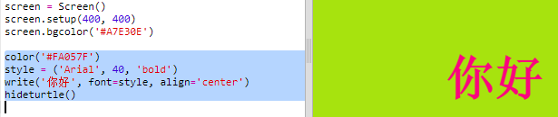

## 使用十六进制颜色代码

Python的turtle模块中有一些预定义的颜色，比如“red”（红色）和“white”（白色），但是你也可以使用颜色的十六进制代码（你可能已经在HTML & CSS课程中看到过这样的代码。）

+ 单击链接<a href="http://jumpto.cc/python-new" target="_blank">jumpto.cc/python-new</a>，打开空白的Python编码页面。

+ 添加以下的代码来导入并使用turtle模块。
    
    
    
    请注意你已经使用了一个预定义的颜色：“white”（白色）。

+ Turtle模块含有一系列预定义的颜色名称供你使用，但有时你想自己选择喜欢的颜色。 所以turtle模块也允许你使用十六进制的颜色代码。
    
    点击打开<a href="http://jumpto.cc/colour-picker" target="_blank"> jumpto.cc/colour-picker </a>链接，并选择你喜欢的颜色。 找到该颜色的以“#”开头的十六进制代码，比如“#A7E30E”。

+ 复制这个十六进制代码，包括开头的井号（高亮选择十六进制代码，然后点击鼠标右键并选择“Copy”（复制），或按Ctrl-C快捷键）。

+ 现在更改设置屏幕颜色的代码行以使用你选择的颜色。 例如：
    
    
    
    你可以鼠标右键点击然后选择“Paste”（粘贴），或按Ctrl-V快捷键来将你的十六进制颜色代码粘贴到你的trinket程序中。

+ 选择另外一个十六进制颜色代码并使用它来设置文字的颜色。
    
    
    
    你不一定要使用“Arial”字体，也可以试一下“Verdana”，“Times”或“Courier”等字体。
    
    "40"是字体的大小，你也可以试试更改它。

+ 尝试不同的颜色，直到你找到两个你真正喜欢并且看上去搭配的颜色。