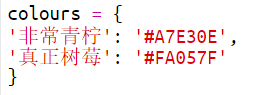
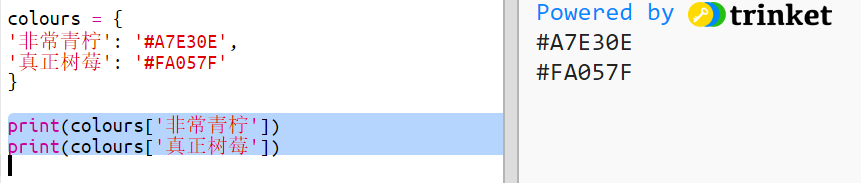
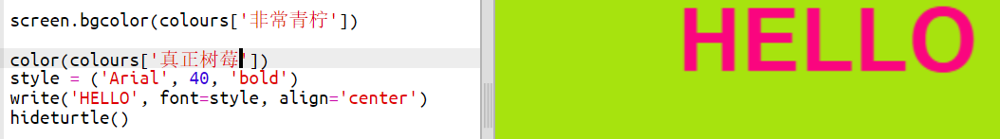

## 颜色字典

使用十六进制颜色代码是非常灵活的, 但它们很难记住。

正如你可能已经知道的, 字典可以让你查找一个词, 并查看它的含义。 在Python中，字典更加灵活 - 它允许您查找字典中任何“键”的值。

让我们创建一个字典，将易于人脑记忆的颜色名称（键名）映射到易于计算机处理的十六进制代码（键值）。

+ 一个字典包含在一对花括号中。
    
    创建一个名 `colours` （颜色）的空白字典：
    
    

+ 为你的颜色选择好听的名字，然后编辑`colours =`行将它们以条目的形式添加到字典中。
    
    下面是一个颜色词典的示例：
    
    
    
    键名（颜色名称）与键值（十六进制代码）之间使用冒号`:`分隔，而在"键名:键值"对之间则用一个逗号`,`分隔。

+ 现在你不需要记住那些十六进制代码，你只需要在字典里查询它们就行了。
    
    调整以下代码以使用你自己的颜色名称：
    
    
    
    将键名放到字典名称后面的方括号“[]”内。

+ 现在，你可以更新你的代码，在字典中查找颜色：
    
    

+ 测试代码以确保你的文字仍然正确显示。