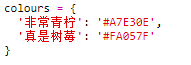
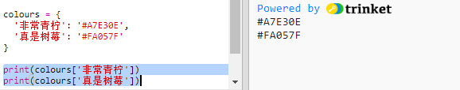
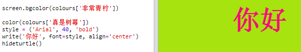

## 颜色字典

 
十六进制颜色代码的使用十分灵活，但却很难记住。 

你可能已经了解到，字典可以让你查询一个词并查看其含义。Python 中的字典甚至更加灵活 — 它能让你查询字典中任何“key”（键）的值。

让我们创建一个字典，将人性化的颜色名称（键）映射为适合电脑的十六进制代码（值）。

+ 字典包含在花括号中： 

  创建一个名为 `colours`（颜色）的空白字典：

   
   
+ 为你的颜色选择一些很酷的名称，并编辑 `colours = ` 这行来将它们的条目添加到字典。 

  以下为一个颜色字典示例：

   
   
   冒号 `:` 将键（颜色名称）与值（十六进制代码）分隔开来。字典中每组 key:value（键：值）之间都需要使用一个逗号 `,`。 

+ 现在你无需记住十六进制代码，只需在字典中查询它们。 

  修改以下代码来使用你的颜色名称：
  
  
  
  键位于字典名称之后的方括号“[]”内部。 
  
+ 现在你可以更新你的代码，从而能在字典中查询颜色：

  
  
  
+ 测试你的代码，以确保你的文本仍能正确显示。 

