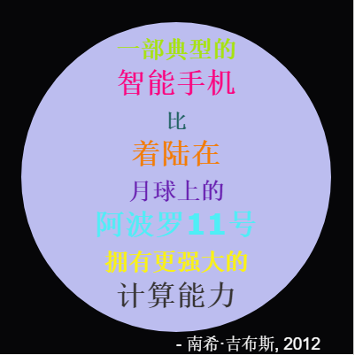

--- challenge ---

## 挑战：制作一张海报

设计师们经常创造“调色板”来保存各种为某些特定主题如沙漠或太空而设定的相互搭配的颜色。

你能够创建一个新的Python项目，使用字典来设置一个主题色彩的调色板吗？ 你可以选择秋天、森林、大海、圣诞节、冰淇淋、你最喜欢的运动队的代表色或者任何你自己的想法。

使用你的调色板字典来制作一张海报。

你还可以使用一些其它的来自于turtle模块的命令，如`forward`，`right`，`left`，`penup`以及`pendown`。

也许你可以为你的海报添加边框？

其他有用的turtle模块中的命令：

+ `circle(50)`画出一个半径为50的空心圆圈。
+ `dot(100)`画出一个直径为100的实心圆。 

下面是一个例子：

--- /challenge ---
