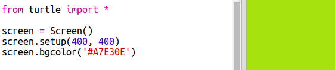

## Using hex colour codes

Python turtle has predefined colours such as 'red' and 'white' but you can also use hex colour codes (you may have seen these in the HTML & CSS course.)

+ 打開空白的 Python 模板： <a href="http://jumpto.cc/python-new" target="_blank">jumpto.cc/python-new</a>。

+ 添加以下程式碼以使用turtle：
    
    
    
    Notice that you used a named colour: 'white'.

+ Turtle has a list of colour names that you can use, but sometimes you want to choose your own colours. Turtle also allows you to use hex colour codes.
    
    打開<a href="http://jumpto.cc/colour-picker" target="_blank"> jumpto.cc/colour-picker </a>並選擇你喜歡的顏色。 找到以“＃”開頭的十六進位色碼標示法，例如“＃A7E30E”。

+ 複製十六進制代碼（包括#），你可以使用滑鼠左鍵，拖曳滑鼠選取文字後，然後右鍵單擊並選擇 “複製”或使用Ctrl+C。

+ Now change the line of code that sets the screen colour to use your colour. 例如：
    
    
    
    You can use right-click and Paste or Ctrl-V to paste your hex code into trinket.

+ Choose another hex colour code and use it to create coloured text:
    
    
    
    您不必使用'Arial'字體，您可以嘗試'Verdana'，'Times'或'Courier'。
    
    '40'是字體大小，您也可以嘗試更改它。

+ 嘗試不同的顏色，直到你找到兩個搭配起來是你真正喜歡的顏色。